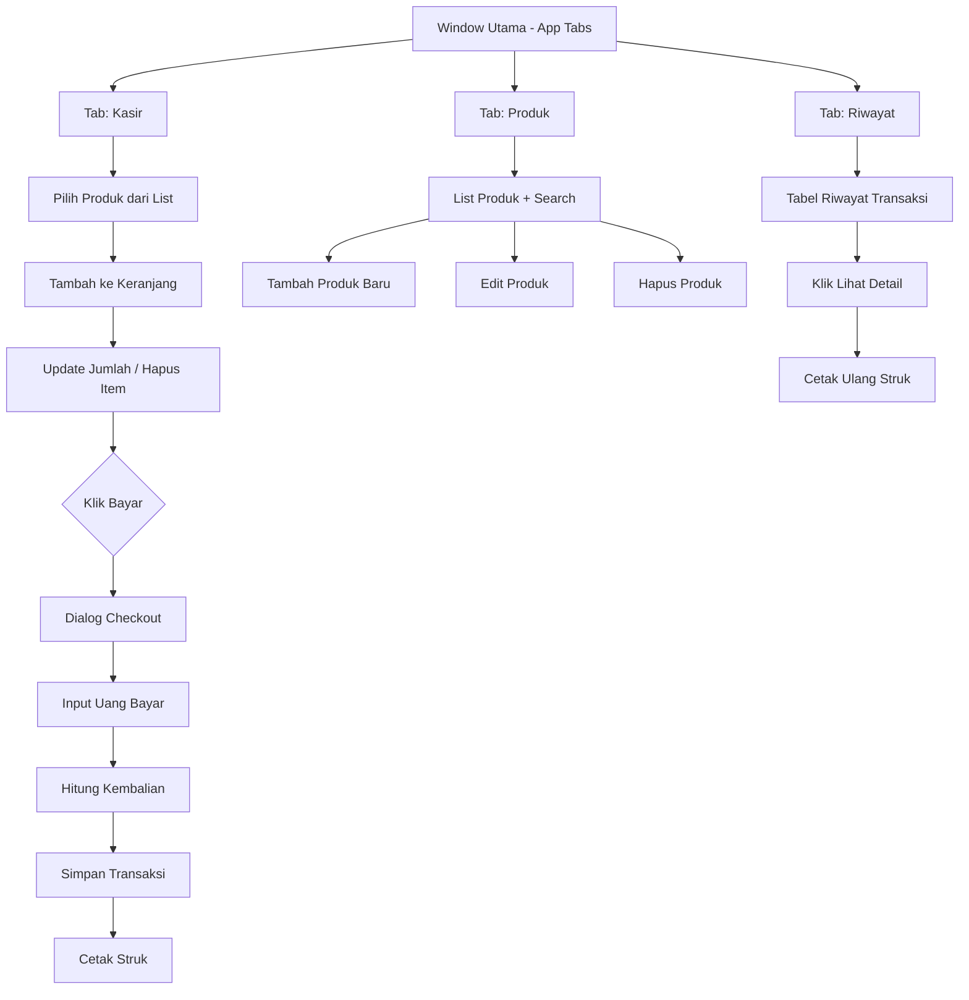

# Arsitektur Aplikasi POS — Go + Fyne v2.7.4

## Requirement

| Aspek     | Spesifikasi                                                |
| --------- | ---------------------------------------------------------- |
| Tipe      | POS kasir sederhana                                        |
| User      | Single-user (tanpa login)                                  |
| Bahasa UI | Bahasa Indonesia                                           |
| Database  | SQLite lokal                                               |
| Printer   | Generate PDF struk + simpan ke file                        |
| Fitur     | Produk CRUD, keranjang, checkout, struk, riwayat transaksi |
| Platform  | macOS (primary), cross-platform (Fyne)                     |

---

## Stack Teknologi

| Komponen      | Library                          | Alasan                                            |
| ------------- | -------------------------------- | ------------------------------------------------- |
| UI Framework  | `fyne.io/fyne/v2` v2.7.4         | Sudah di go.mod                                   |
| ORM + Driver  | `gorm.io/gorm` + `github.com/glebarez/sqlite` | GORM AutoMigrate, parameterized query (anti SQL injection), relasi FK, transaksi. Driver pure Go — no CGO, cross-compile aman |
| PDF Generator | `github.com/jung-kurt/gofpdf`     | Generate struk PDF, ringan, pure Go               |

---

## Arsitektur Folder

```
go-fyne-desktop/
├── main.go                    # Entry point, inisialisasi DB, start app
├── go.mod                     # (sudah ada)
├── go.sum                     # (sudah ada)
├── internal/
│   ├── db/
│   │   └── db.go              # Koneksi GORM + SQLite, AutoMigrate
│   ├── models/
│   │   ├── produk.go          # Struct Produk (GORM model) + method CRUD
│   │   ├── transaksi.go       # Struct Transaksi (GORM model) + method
│   │   └── detail_transaksi.go # Struct DetailTransaksi (GORM model)
│   ├── printer/
│   │   └── pdf.go              # Generate struk PDF via gofpdf, simpan ke file
│   ├── services/
│   │   ├── produk_service.go  # Business logic produk
│   │   ├── kasir_service.go   # Logic keranjang + checkout
│   │   └── transaksi_service.go
│   └── theme/
│       └── theme.go           # Custom Fyne theme (warna, font)
├── ui/
│   ├── app.go                 # Fyne app setup, window utama, navigasi
│   ├── produk/
│   │   ├── list.go            # Layar daftar produk
│   │   └── form.go            # Form tambah/edit produk
│   ├── kasir/
│   │   ├── kasir.go           # Layar utama kasir (produk + keranjang)
│   │   ├── keranjang.go       # Komponen tabel keranjang
│   │   └── checkout.go        # Dialog checkout + pembayaran
│   ├── transaksi/
│   │   ├── riwayat.go         # Layar riwayat transaksi
│   │   └── detail.go          # Dialog detail satu transaksi
│   └── struk/
│       └── preview.go         # Dialog preview struk (native Fyne widget), tombol Cetak PDF + Tutup
└── assets/
    └── logo.png               # (opsional)
```

---

## Skema Database (SQLite)

```sql
-- Tabel produk
CREATE TABLE IF NOT EXISTS produk (
    id          INTEGER PRIMARY KEY AUTOINCREMENT,
    kode        TEXT NOT NULL UNIQUE,       -- Kode/Barcode produk (input manual)
    nama        TEXT NOT NULL,
    harga       INTEGER NOT NULL,           -- Harga jual (rupiah, integer — hindari float)
    stok        INTEGER NOT NULL DEFAULT 0, -- Stok otomatis berkurang saat checkout
    created_at  DATETIME DEFAULT CURRENT_TIMESTAMP,
    updated_at  DATETIME DEFAULT CURRENT_TIMESTAMP
);

-- Tabel transaksi (header)
CREATE TABLE IF NOT EXISTS transaksi (
    id            INTEGER PRIMARY KEY AUTOINCREMENT,
    no_struk      TEXT NOT NULL UNIQUE,       -- Format: INV-20260617-0001
    total         INTEGER NOT NULL,           -- Total dalam rupiah
    bayar         INTEGER NOT NULL,           -- Uang diterima
    kembali       INTEGER NOT NULL,           -- Kembalian
    created_at    DATETIME DEFAULT CURRENT_TIMESTAMP
);

-- Tabel detail transaksi (line items)
CREATE TABLE IF NOT EXISTS detail_transaksi (
    id              INTEGER PRIMARY KEY AUTOINCREMENT,
    transaksi_id    INTEGER NOT NULL,
    produk_id       INTEGER NOT NULL,
    nama_produk     TEXT NOT NULL,            -- Denormalisasi, snapshot saat checkout
    harga_satuan    INTEGER NOT NULL,
    jumlah          INTEGER NOT NULL,
    subtotal        INTEGER NOT NULL,
    FOREIGN KEY (transaksi_id) REFERENCES transaksi(id),
    FOREIGN KEY (produk_id) REFERENCES produk(id)
);
```

> **Mengapa harga pakai INTEGER (rupiah)?** Menghindari floating-point rounding errors. Semua kalkulasi dalam satuan rupiah (1 Rupiah = 1). Format tampilan: `Rp 10.000`.

---

## Navigasi Layar & Flow



**Fyne Widget yang dipakai:**
- `container.AppTabs` — navigasi utama (Kasir | Produk | Riwayat)
- `widget.List` / `widget.Table` — daftar produk, daftar transaksi
- `widget.Entry` — input barcode, jumlah, uang bayar
- `widget.Button` — aksi (Tambah, Edit, Hapus, Bayar, Cetak)
- `widget.Label` — tampilan total, kembalian
- `widget.PopUp` / `dialog.CustomDialog` — checkout dialog
- `widget.Search` / filter entry — cari produk
- `binding.FloatToString` / `IntToString` — binding data real-time

---

## Generate Struk PDF

Pakai `github.com/jung-kurt/gofpdf`. Struk disimpan ke file PDF, bisa dibuka langsung atau dicetak ke printer apa pun.

Struk layout standar:
- Header: Nama Toko, Alamat, No Struk, Tanggal
- Divider garis
- Item: Nama, Jml x Harga, Subtotal
- Divider
- Footer: Total, Bayar, Kembali

```go
pdf := gofpdf.New("P", "mm", "80", "200") // Ukuran thermal 80mm
pdf.AddPage()
pdf.SetFont("Arial", "B", 12)
pdf.CellFormat(40, 10, "TOKO POS", "", 1, "C", false, 0, "")
// ... item items ...
pdf.OutputFileAndClose("struk/INV-20260617-0001.pdf")
```

**Lokasi penyimpanan:** folder `struk/` di samping binary, auto-create jika belum ada.

**Buka PDF:** gunakan `os/exec` → `open` (macOS) / `xdg-open` (Linux) / `rundll32` (Windows).

### Preview Struk — Native Fyne Widget (Opsi A)

Setelah checkout sukses, tampilkan **dialog preview** (`dialog.NewCustomDialog`) yang merender ulang isi struk menggunakan widget Fyne:

```
┌──────────────────────────────────┐
│          TOKO POS                │
│     Jl. Contoh No. 123           │
│──────────────────────────────────│
│ No: INV-20260617-0001            │
│ Tgl: 17/06/2026 13:45            │
│──────────────────────────────────│
│ Kopi Hitam        2  x Rp 5.000 │
│                        Rp 10.000 │
│ Roti Bakar        1  x Rp 8.000 │
│                        Rp  8.000 │
│──────────────────────────────────│
│ Total:              Rp 18.000   │
│ Bayar:              Rp 20.000   │
│ Kembali:            Rp  2.000   │
│──────────────────────────────────│
│         Terima Kasih             │
│──────────────────────────────────│
│     [Cetak PDF]    [Tutup]      │
└──────────────────────────────────┘
```

**Komponen widget preview:**
- `widget.Label` monospace untuk header, item, footer (alignment kolom)
- `widget.Separator` untuk garis pemisah
- `widget.Button` "Cetak PDF" → generate PDF + buka di viewer OS
- `widget.Button` "Tutup" → kembali ke layar kasir, reset keranjang

**Flow:**
1. Checkout sukses → simpan transaksi ke DB
2. Tampilkan dialog preview struk (native widget)
3. User klik "Cetak PDF" → generate `gofpdf` ke file, lalu `exec.Command("open", file)` (macOS)
4. User klik "Tutup" → reset keranjang, siap transaksi baru

---

## Rencana Implementasi (Urutan)

| #   | Langkah                                           | File Utama                                                     | Ketergantungan |
| --- | ------------------------------------------------- | -------------------------------------------------------------- | -------------- |
| 1   | Setup GORM + `go-sqlite` driver + AutoMigrate     | [`internal/db/db.go`](internal/db/db.go)                       | —              |
| 2   | Model `Produk` + GORM tags + CRUD methods         | [`internal/models/produk.go`](internal/models/produk.go)       | #1             |
| 3   | Model `Transaksi` + `DetailTransaksi` + GORM tags | [`internal/models/transaksi.go`](internal/models/transaksi.go) | #1             |
| 4   | Service layer (business logic)                    | [`internal/services/`](internal/services/)                     | #2, #3         |
| 5   | UI: Tab Produk (list + form CRUD)                 | [`ui/produk/`](ui/produk/)                                     | #2, #4         |
| 6   | UI: Tab Kasir (produk picker + keranjang)         | [`ui/kasir/`](ui/kasir/)                                       | #2, #4         |
| 7   | UI: Checkout dialog + simpan transaksi            | [`ui/kasir/checkout.go`](ui/kasir/checkout.go)                 | #3, #4, #6     |
| 8   | UI: Tab Riwayat Transaksi                         | [`ui/transaksi/`](ui/transaksi/)                               | #3             |
| 9   | Generate PDF struk + buka/cetak                   | [`internal/printer/pdf.go`](internal/printer/pdf.go)           | #3, #7         |
| 10  | Polishing + testing                               | Semua                                                          | #1–#9          |

---

## Catatan Teknis

### Harga dalam INTEGER (Rupiah)
```go
// Hindari:
harga := 15000.00 // float64 — BAHAYA untuk uang

// Gunakan:
harga := 15000 // int — aman
// Format tampilan: fmt.Sprintf("Rp %s", humanize.Comma(harga))
```

### Fyne Table vs List
- **`widget.List`** — untuk data sangat banyak (>100), pakai virtual scrolling, template per item
- **`widget.Table`** — untuk tampilan kolom (seperti spreadsheet), ada header
- Untuk daftar produk: **`widget.List`** (scroll performan)
- Untuk keranjang checkout: **`widget.Table`** (butuh kolom: Nama, Jumlah, Harga, Subtotal)
- Untuk riwayat transaksi: **`widget.Table`**

### Search / Filter
Entry di atas list produk → filter by `nama` atau `kode` (LIKE query SQL). Bisa juga pakai barcode scanner sebagai keyboard input (fokus Entry).

### Konvensi Penamaan
- File Go: `snake_case.go`
- Package: `lowercase` single word
- UI text: Bahasa Indonesia
- Kode: English

---

## Keputusan Desain Final

| # | Pertanyaan | Keputusan | Dampak |
|---|-----------|-----------|--------|
| 1 | Barcode scanner? | **Tidak** — input manual kode via keyboard | Entry kode di kasir pakai field teks biasa |
| 2 | Stok auto-kurang? | **Ya** — stok berkurang otomatis saat checkout | Service checkout jalankan `UPDATE produk SET stok = stok - jumlah` dalam transaksi DB |
| 3 | Diskon? | **Tidak** — harga tetap | Tidak ada field diskon di model atau UI |
| 4 | Kategori produk? | **Tidak** — abaikan | Drop kolom `kategori` dari tabel produk. UI produk: kode, nama, harga, stok saja |

### Detail: Logika Stok Turun

Saat checkout, dalam **satu transaksi database**:
1. Validasi stok setiap item: `stok >= jumlah`
2. Kurangi stok: `UPDATE produk SET stok = stok - ? WHERE id = ?`
3. Insert transaksi + detail transaksi
4. Generate PDF struk

Jika stok tidak cukup → batalkan, tampilkan error ke user.

> **Edge case:** Jika stok habis di tengah checkout karena concurrent user (tidak relevan untuk single-user, tapi tetap handle error constraint).
